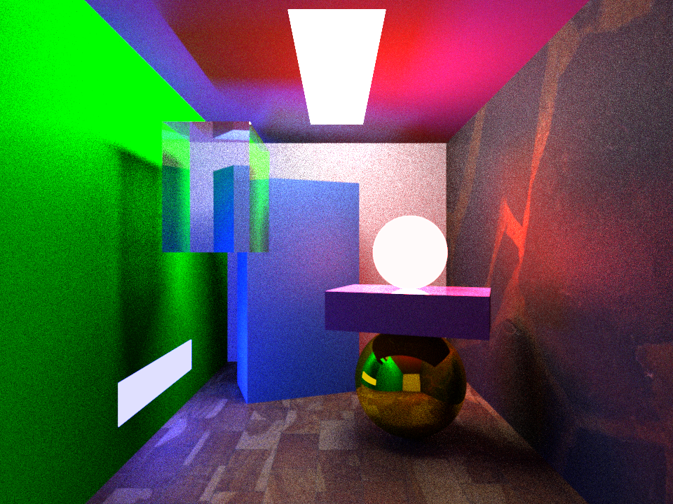

# js-tracer
## A JavaScript-based raytracer that runs in your browser

This project is a reimplementation of [my previous raytracer in C#](https://github.com/helpvisa/simple_raytracer), created in the hopes of making the code more legible, coherent, and usable in a web-based environment.

The limitations of plain JavaScript and scope of the project means that this raytracer, despite its ability to render PBR-based materials, remains single-threaded for the time being. This means high resolutions are likely to make your browser sluggish; 320x240 is recommended for most PCs, and you can save the final image by right-clicking on the canvas!

You can download the project for yourself and modify `index.js` to customize the rendered image; work is in progress to allow you to modify the scene setup from the webpage directly.

You can try a render for yourself at [this GitHub pages link!](https://helpvisa.github.io/js-tracer/)

This project makes use of the seedrandom.js library, which can be found on GitHub [at this link.](https://github.com/davidbau/seedrandom)